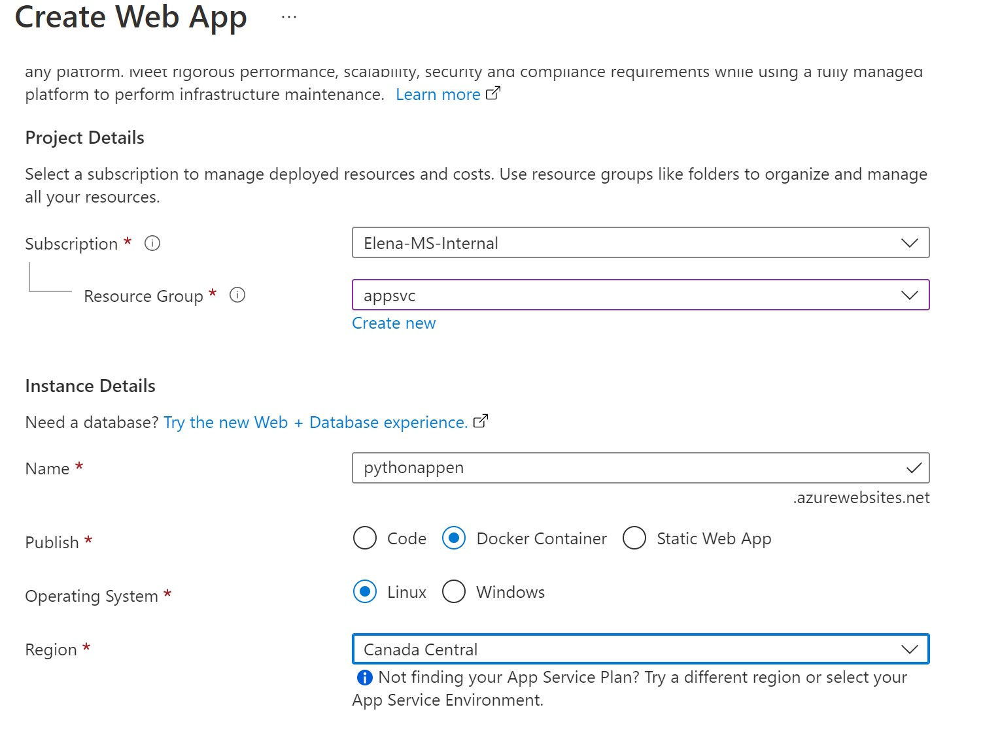
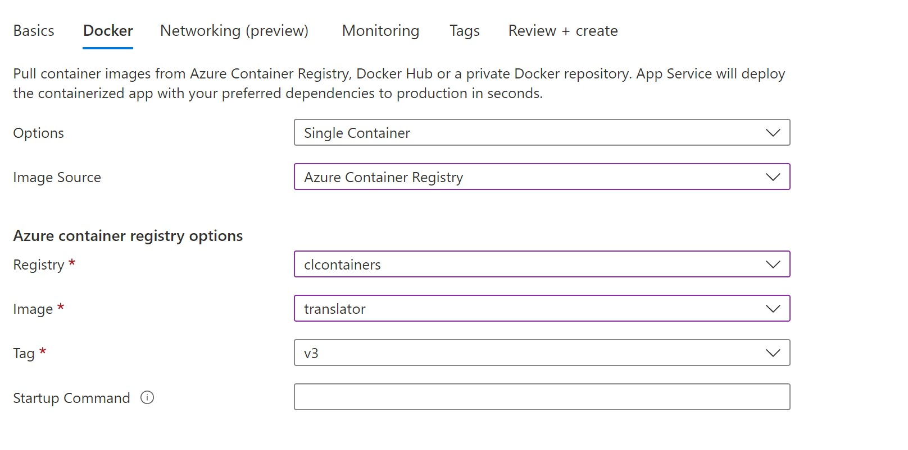
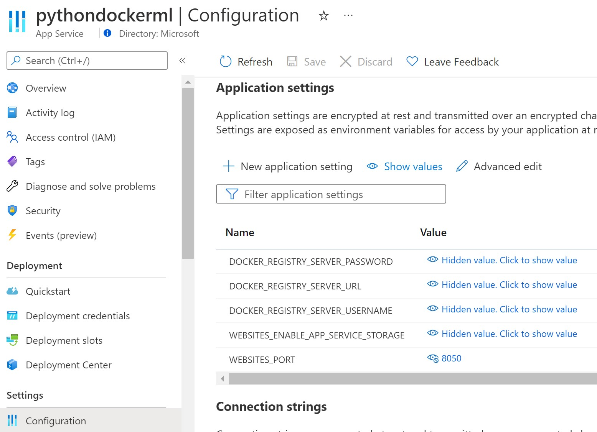
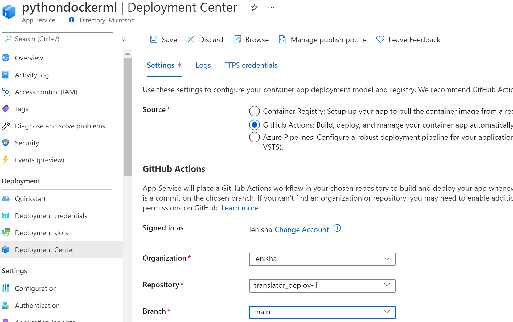

# Building and Deploying Python Container Locally and on App Service

## Explore and Run Python Application Locally

## 1. Clone Application Repo 

```sh
git clone git@github.com:lenisha/translator_deploy-1.git
cd translator_deploy-1.git
```


## 2. Build Docker image using **default**  `Dockerfile` and list images

```sh
docker build -t translator:v1 .

docker images
```

Note: build takes around 7 min and all consequent builds take same time to reinstall `requirements.txt`


## 2.1 Run image locally

```sh
docker run --rm -d --name translator -p 8050:8050 translator:v1

#  check running container
docker ps
CONTAINER ID   IMAGE           COMMAND           CREATED         STATUS         PORTS
    NAMES
49fd77d490f4   translator:v1   "python app.py"   4 seconds ago   Up 3 seconds   0.0.0.0:8050->8050/tcp, :::8050->8050/tcp   translator
```

## 3. Build Docker image using **faster** method that will reuse cached laeyrs and only rebuild application layer

```sh
docker build -t translator:v2 -f Dockerfile.fast .
```

change anything in `app.py` file and run build again -> only last layer packing application is rebuild

```sh
 => [internal] load build definition from Dockerfile.fast
 => => transferring dockerfile: 43B                                                                   
 => [internal] load .dockerignore                                                       
 => => transferring context: 2B                                                                                    
 => [internal] load metadata for docker.io/library/python:3.9                                    
 => [1/5] FROM docker.io/library/python:3.9                                       
 => [internal] load build context                                           
 => => transferring context: 21.39kB                                     
 => CACHED [2/5] WORKDIR /app                                                                                      
 => CACHED [3/5] COPY ./requirements.txt requirements.txt                                    
 => CACHED [4/5] RUN set -ex &&     pip install -r requirements.txt                             
 => [5/5] COPY . .                                                           
 => exporting to image                                                      
 => => exporting layers                                                                                            
 => => writing image sha256:a20810a4574c46d21a8b1c7543af1                      
 => => naming to docker.io/library/translator:v2 
```
In this version we first install all required packages and in last commands copy the application

```Dockerfile
COPY ./requirements.txt requirements.txt
RUN set -ex && \
    pip install -r requirements.txt

COPY . .
```

## 4. Multi-stage Docker build to optimize image size

```sh
docker build -t translator:v3 -f Dockerfile.slim .
```

In this example we use full `python:3.9` base image to install/build required packages, and then copy them into slimmer version `python:3.9-slim` based container

```Dockerfile

# temp build stage
FROM python:3.9 as builder

COPY requirements.txt .
RUN pip install -r requirements.txt


# final runtime stage
FROM python:3.9-slim

COPY --from=builder /opt/venv /opt/venv
COPY . /app

WORKDIR /app


EXPOSE 8050
CMD ["python", "app.py"]
```

## 5. Compare the images

```sh
docker images
REPOSITORY                                                   TAG        IMAGE ID       CREATED         SIZE
translator                                                   v2         0281e7811b87   2 minutes ago   1.36GB
translator                                                   v3         d4a72310955a   3 minutes ago   452MB
translator                                                   v1         6cd95bbbc333   8 minutes ago   1.36GB
```

## 6. Use Docker BuildKit to speedup builds 

[what-is-dockers-buildkit-and-why-does-it-matter/](https://www.cloudsavvyit.com/12441/what-is-dockers-buildkit-and-why-does-it-matter/)

```
DOCKER_BUILDKIT=1 docker build -t translator:v4 -f Dockerfile.slim .
```

# Azure Setup 

## 1. Create Azure Container Registry ( to host images)

## 2. Push image to Azure Container registry

   
   There are two ways to do that - using docker cli or azure cli

   ### 2.0.  Login to Azure using `az login`

   ### 2.1.  Docker cli push requires to properly tag images with the name of the docker registry login server
   (More details in [Push your first image to your Azure container registry using the Docker CLI](https://docs.microsoft.com/en-us/azure/container-registry/container-registry-get-started-docker-cli?tabs=azure-cli))

   Tag local image with ACR repo url ( to get the url navigate in Azure potrl to Container registry -> Access Keys and copy Login Server)

   ```sh
   docker tag translator:v3 clcontainers.azurecr.io/translator:v3

   # verify the tag 
   docker images
REPOSITORY                                                   TAG        IMAGE ID       CREATED          SIZE
translator                                                   v2         c7ea95de58a4   2 minutes ago    1.36GB
clcontainers.azurecr.io/translator                           v3         d4a72310955a   16 minutes ago   452MB
translator                                                   v3         d4a72310955a   16 minutes ago   452MB
   ```

Push docker image
```sh
 docker push clcontainers.azurecr.io/translator:v3
```

List ACR Repos

```sh
az acr repository list --name clcontainers

[
  "dashml",
  "mattermost/mattermost-enterprise-edition",
  "ratings-api",
  "ratings-web",
  "translator"
]
```

 ### 2.3. Azure CLI ACR command will build and push image using one command **without** docker installed. More in the command in [Build and deploy container images in the cloud with Azure Container Registry Tasks](https://docs.microsoft.com/en-us/azure/container-registry/container-registry-tutorial-quick-task)
   

   ```sh

   az acr build --registry clcontainers --image translator:v4 -f Dockerfile.slim .
   ```

## 3. Create Azure App Service ( Docker, Linux)

- Create web app and point to the newly pushed to ACR Image






- Update App Configuration to direct AppService to the port exposed by the container, by adding new Application setting `WEBSITES_PORT`



- Verify application has started using appservice URL

- To troubleshoot navigate to Log Stream blade


# 4. Enable CI/CD
To enable CI/CS navigate to `Deployment Center` and Switch to Github Actions - it will generate GH Actions flow that will build container and deploy to App Service on any code change.



## References
[Speed Up The Build of Your Python Docker Image](https://vsupalov.com/speed-up-python-docker-image-build/)

[How Does the Docker Cache Work](https://vsupalov.com/docker-cache/)

[Optimizing the image size](https://devopswithdocker.com/part-3/4-optimizing-the-image-size)

[Push your first image to your Azure container registry using the Docker CLI](https://docs.microsoft.com/en-us/azure/container-registry/container-registry-get-started-docker-cli?tabs=azure-cli)


[Configure a custom container for Azure App Service](https://docs.microsoft.com/en-us/azure/app-service/configure-custom-container?pivots=container-linux)

[Environment variables and app settings in Azure App Service](https://docs.microsoft.com/en-us/azure/app-service/reference-app-settings?tabs=kudu%2Cdotnet)