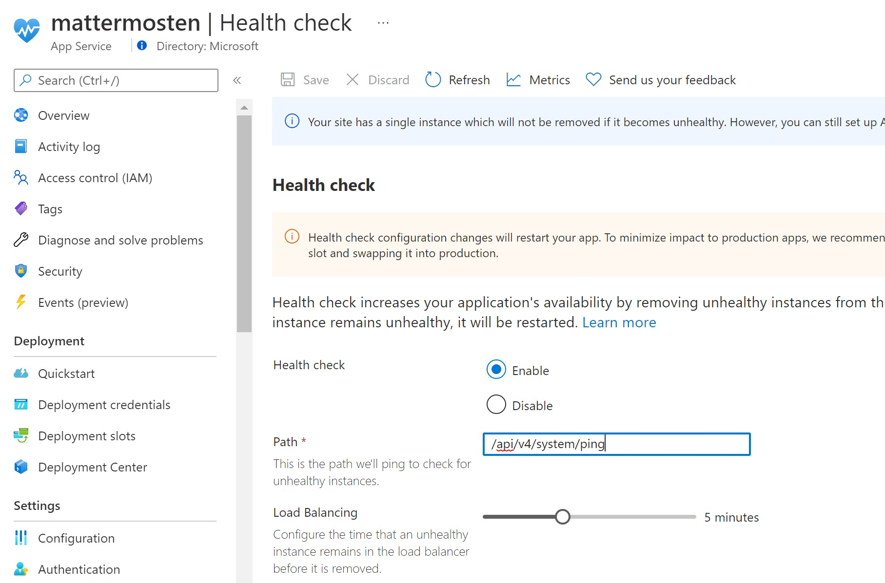

# Deploying and Running MatterMost Container on App Service 

## 1. Mattermost on Docker

Instructions for installing mattermost on docker are at their docs site: [Install Mattermost via Docker](https://docs.mattermost.com/install/install-docker.html)

To run the server it uses docker compose to manage multiple containers - postgres, nginx and mattermost.

To run it in Azure we will externalize Postgres and use Azure Postgres server (fully managed by MSFT) and we do not need Nginx reverse proxy, since Azure App Service provides the required functionality such as TLS termination.

Mattermost server also uses storage volumes to store indexes and configuration etc. On Azure we could use Azure Storage Account Files and map them to App Service.


## 2. Setup Azure Prereqs

- Create `Azure Database for PostgreSQL flexible server` 


- Create `Azure Storage Account` and file share to map to container


- Create ACR (if not yet created previously)


## 3. Import mattermost container to ACR

- Login to azure using `az login`

- Import Mattermost container to ACR using cli. More details on the command in [ACR Import Images](https://docs.microsoft.com/en-us/azure/container-registry/container-registry-import-images?tabs=azure-cli, where `clcontainers` is name of ACR
)

```sh
az acr import -n clcontainers --source  docker.io/mattermost/mattermost-enterprise-edition:6.3 --image mattermost/mattermost-enterprise-edition:6.3
```

## 4. Run Docker Compose Locally [Optionally]

- Create your .env file by copying and adjusting the env.example file

```sh
cp env.example .env
```

- Edit `.env`  to replace values for  `POSTGRES_PASSWORD` to the created DB passoword and set image in `docker-appservice.yaml` to the ACR image tag

- Create the required directories and set their permissions

```sh
mkdir -p ./volumes/app/mattermost/{config,data,logs,plugins,client/plugins,bleve-indexes}
sudo chown -R 2000:2000 ./volumes/app/mattermost
```


- Run docker compose locally

```sh
 docker-compose -f docker-appservice.yml  -f docker-local.yml up -d
```
- Verify site navigating to http://127.0.0.1.nip.io:8065/

- Shutdown docker

```sh
 docker-compose -f docker-appservice.yml  -f docker-local.yml down -d
```


## 5. Create Azure App Service

- Create WebApp with Setting it to use Linux and Docker and upload `docker-appservice.yml` from this repo


You could choose single container or Compose (Preview) to run the AppService


### 5.1 Deploying Single Container
- Set Container from ACR in Deployment Center


### 5.1 Deploying Multi Container Container
- Upload `docker-appservice.yaml` Compose YAML definition in Deployment Center


## 6. Update settings and create File Mappings

- As shown in Docker Compose YAML we need to set env  variables  
  - `MM_SQLSETTINGS_DATASOURCE` to Azure Postgres connection string 
  - `MM_SERVICESETTINGS_SITEURL` to App Service URL
  - `MATTERMOST_VOLUME_PATH` volume path
  - `WEBSITES_PORT` to mattermost container exposed port. 

- if Running Single Container (hard-coded in compose yaml)

  - `TZ` to time zone
  - `MM_SQLSETTINGS_DRIVERNAME` postgress drivername
  - `MM_BLEVESETTINGS_INDEXDIR` path to indexes


See `appsettings.json` for example configuration in this repo.

### 6.2 Create file mappings 
- create file mappings in App Service settings pointing to Azure Files in Storage Account and giving same names in share as in Compose manifest `/mattermost/config|data|logs`


- Restart the app service and navigate to mattermost url

- For troubleshooting use `Log Stream`

## 7. Optional - Configure healthcheck

To improve availability add healthcheck



## References
[Create a multi-container (preview) app in Web App for Containers](https://docs.microsoft.com/en-us/azure/app-service/tutorial-multi-container-app)

[Mounting Volumes on Azure Web App for Containers](https://www.codit.eu/blog/mounting-volumes-on-azure-web-app-for-containers/?country_sel=be)